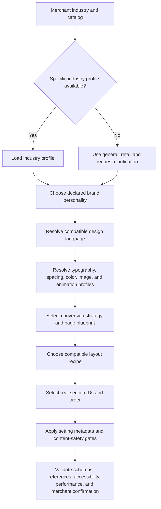
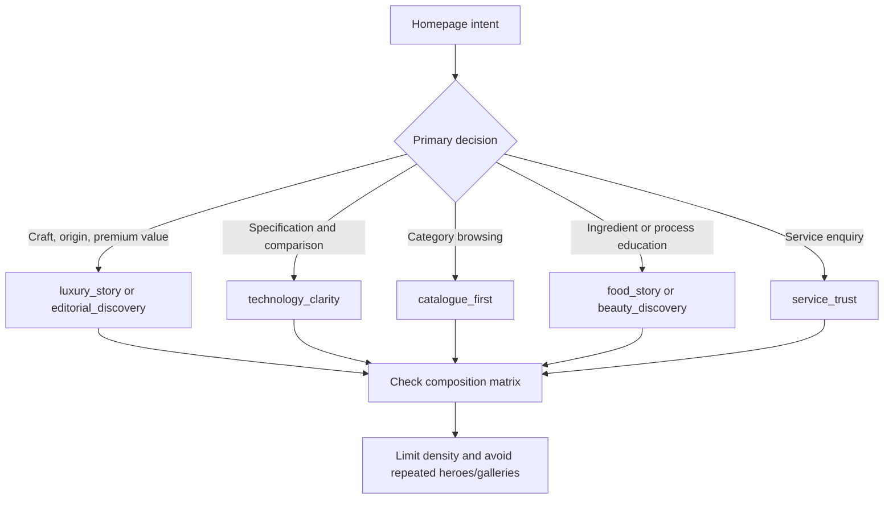
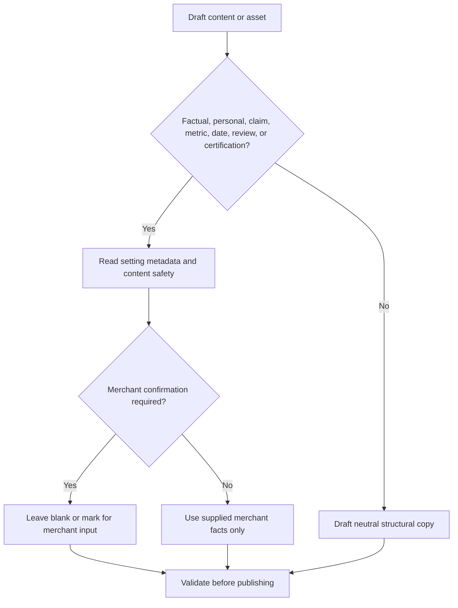

# Calinium design decision trees

These trees describe a constrained decision sequence. An AI may propose a configuration only after the prior decision is supported by merchant input and validated against the catalogs.

Final validation always checks: valid IDs, real sections, recipe limits, compatibility, mobile reading order, existing accessibility/performance conventions, Shopify schema compatibility, and merchant verification gates.
