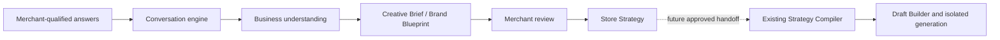

# AI Creative Director v1

Creative Director v1 is Calinium’s deterministic, provider-independent reasoning entry point. It makes the product principle operational: the merchant describes the business; Calinium recommends a design direction and technical approach; the merchant approves meaningful creative choices.

It does not generate Liquid, Shopify templates, merchant copy, drafts, theme files, or deployments. The existing Strategy Compiler, Draft Builder, Theme Generator, review workflow, and deployment lifecycle are retained unchanged.

## Flow and boundaries

The local implementation is intentionally rule-based. `ai/providers/creative-director-provider.js` defines the future provider seam, while `LocalCreativeDirectorProvider` parses the current question deterministically. Any future provider must return structured candidates through that seam; it may not mutate conversation state or label inference as merchant-confirmed fact.

## Merchant-facing dashboard

The [Merchant Creative Director Dashboard](../dashboard/dashboard-architecture.md) is the visual interface for this flow. Its React components consume only a same-origin service/API boundary. The new server-only `CreativeDirectorAdapter` calls the public conversation and pipeline interfaces, while `CreativeDirectorService` persists a project-scoped session, records activity, applies authorization, and enforces approval-only forward transitions. The dashboard shows the Creative Brief as a **Brand Blueprint**, groups resource requests without exposing raw theme settings, and never treats an isolated review package as a live Shopify preview.

## Modules

| Module | Responsibility |
| --- | --- |
| `ai/conversation/` | One-question-at-a-time merchant dialogue, progress, corrections, unknown handling, and duplicate-question prevention. |
| `ai/understanding/` | Input normalization, fact/inference separation, confidence calculations, and missing-critical-fact detection. |
| `ai/creative-brief/` | Creates and validates the Creative Brief. The merchant-facing label is Brand Blueprint. |
| `ai/recommendations/` | Small recommendation adapters for design direction, colors, typography, homepage, and navigation. |
| `ai/store-strategy/` | Builds and validates the merchant-reviewable Store Strategy, grounding installed-section choices through the existing compiler when its conservative adapter can resolve an industry. |
| `pipeline/` | Stable orchestration and review-state surface. It may hand an explicitly approved, resource-complete configuration to the existing generation pipeline; it never invents merchant resources or bypasses approval gates. |

## Fact, inference, and confidence policy

- A merchant response is a fact with confidence `0.90`; an explicit correction is `1.00`.
- An inference is never higher than `0.89`, includes a rationale, and appears under `assumptions`, never under `facts`.
- Offer, audience, and primary goal are critical. If absent, the Brief is not ready and the conversation cannot continue to an interactive confirmation.
- Optional low-confidence details remain uncertainty records; Calinium does not fill them in silently.

Confidence bands are low (`0.00–0.39`), moderate (`0.40–0.69`), high (`0.70–0.89`), and explicitly confirmed (`0.90–1.00`).

## Existing compiler integration

`ai/store-strategy/legacy-profile-adapter.js` produces a temporary, conservative adapter profile only when the offer yields an installed knowledge-catalog industry. It does not rewrite or replace a merchant’s canonical profile. `compile-storefront-strategy.js creative-director --input creative-brief.json` is an opt-in compatibility mode; its original `compile`, `validate`, and `explain` commands retain their existing Merchant Profile behavior.

The Store Strategy keeps the resulting legacy strategy in `traceability.legacyCompilerStrategy`. Its own confidence and approval requirements remain explicit, so compiler-derived recommendations are not misrepresented as merchant facts.

## Safety and current limitations

- No external AI calls, API keys, web scraping, Shopify access, or additional dependencies are used.
- Fixture output is non-sensitive demonstrative data only. Do not commit actual merchant data written below `output/`.
- A reviewed Store Strategy is not an approved Draft Configuration. Theme generation remains a separate, explicit approval workflow.
- Natural-language interpretation is deliberately narrow in v1. The conversation parser handles the active question rather than attempting open-ended claims or arbitrary business analysis.

See [Creative Brief schema](../schemas/creative-brief.md), [Store Strategy schema](../schemas/store-strategy.md), [CLI guide](../guides/creative-director-cli.md), and the [current-system audit](current-system-audit.md).
