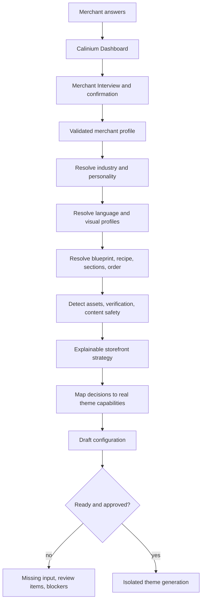

# AI Pipeline Diagram

```mermaid
flowchart TD
  Merchant[Merchant answers] --> Dashboard[Calinium Dashboard]
  Dashboard --> Interview[Merchant Interview and confirmation]
  Interview --> Profile[Validated merchant profile]
  Profile --> Industry[Resolve industry and personality]
  Industry --> Visual[Resolve language and visual profiles]
  Visual --> Plan[Resolve blueprint, recipe, sections, order]
  Plan --> Safety[Detect assets, verification, content safety]
  Safety --> Strategy[Explainable storefront strategy]
  Strategy --> Map[Map decisions to real theme capabilities]
  Map --> Draft[Draft configuration]
  Draft --> Gate{Ready and approved?}
  Gate -- no --> ReviewQueue[Missing input, review items, blockers]
  Gate -- yes --> Generate[Isolated theme generation]
```

See [AI pipeline](../04-ai-pipeline.md).
