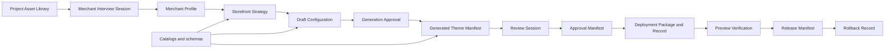

# Data Flow Diagram

```mermaid
flowchart LR
  Asset["Project Asset Library"] --> I
  I[Merchant Interview Session] --> P[Merchant Profile]
  P --> S[Storefront Strategy]
  S --> D[Draft Configuration]
  D --> A[Generation Approval]
  A --> G[Generated Theme Manifest]
  G --> R[Review Session]
  R --> AM[Approval Manifest]
  AM --> DP[Deployment Package and Record]
  DP --> PV[Preview Verification]
  PV --> RM[Release Manifest]
  RM --> RR[Rollback Record]
  K[Catalogs and schemas] --> S
  K --> D
  K --> G
```

See [data flow](../03-data-flow.md).
