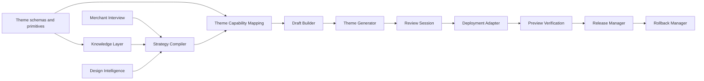

# Dependency Graph Diagram

```mermaid
flowchart LR
  Theme[Theme schemas and primitives] --> Knowledge[Knowledge Layer]
  Interview[Merchant Interview] --> Compiler[Strategy Compiler]
  Theme --> Capability[Theme Capability Mapping]
  Knowledge --> Compiler[Strategy Compiler]
  Intelligence[Design Intelligence] --> Compiler
  Compiler --> Capability
  Capability --> Draft[Draft Builder]
  Draft --> Generator[Theme Generator]
  Generator --> Review[Review Session]
  Review --> Deployment[Deployment Adapter]
  Deployment --> Verification[Preview Verification]
  Verification --> Release[Release Manager]
  Release --> Rollback[Rollback Manager]
```

See [extensibility](../08-extensibility.md).
