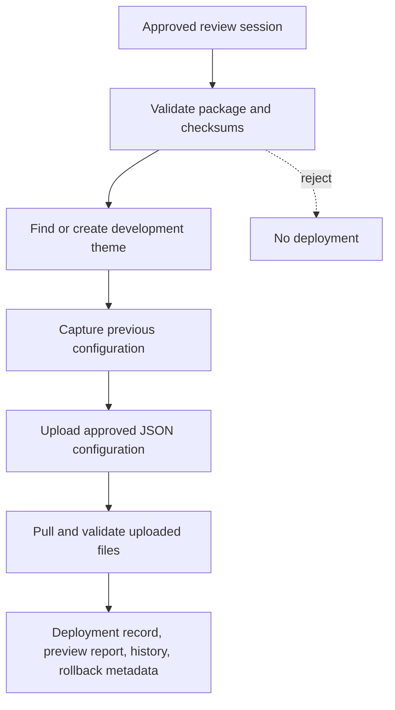

# Deployment Pipeline Diagram

```mermaid
flowchart TD
  Session[Approved review session] --> Check[Validate package and checksums]
  Check --> Target[Find or create development theme]
  Target --> Snapshot[Capture previous configuration]
  Snapshot --> Upload[Upload approved JSON configuration]
  Upload --> Validate[Pull and validate uploaded files]
  Validate --> Report[Deployment record, preview report, history, rollback metadata]
  Check -. reject .-> Stop[No deployment]
```

See [review and deployment](../06-review-deployment.md) and [deployment workflow](../../ai/deployment-workflow.md).
