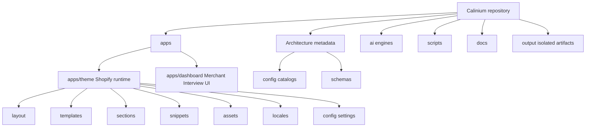

# Folder Structure Diagram

```mermaid
flowchart TD
  Root[Calinium repository]
  Root --> Apps[apps]
  Apps --> Theme[apps/theme Shopify runtime]
  Theme --> Layout[layout]
  Theme --> Templates[templates]
  Theme --> Sections[sections]
  Theme --> Snippets[snippets]
  Theme --> Assets[assets]
  Theme --> Locales[locales]
  Theme --> ThemeConfig[config settings]
  Apps --> Dashboard[apps/dashboard Merchant Interview UI]
  Root --> Intelligence[Architecture metadata]
  Intelligence --> Catalogs[config catalogs]
  Intelligence --> Schemas[schemas]
  Root --> Engines[ai engines]
  Root --> Validators[scripts]
  Root --> Docs[docs]
  Root --> Evidence[output isolated artifacts]
```

See [theme engine](../05-theme-engine.md) and [development guide](../09-development-guide.md).
