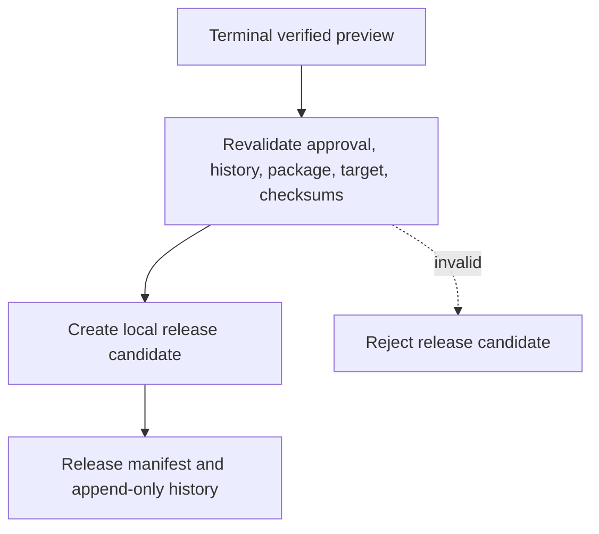

# Release Workflow Diagram

```mermaid
flowchart TD
  Verified[Terminal verified preview] --> Gate[Revalidate approval, history, package, target, checksums]
  Gate --> Candidate[Create local release candidate]
  Candidate --> Manifest[Release manifest and append-only history]
  Gate -. invalid .-> Stop[Reject release candidate]
```

This workflow never publishes a theme. See [review and deployment](../06-review-deployment.md).
