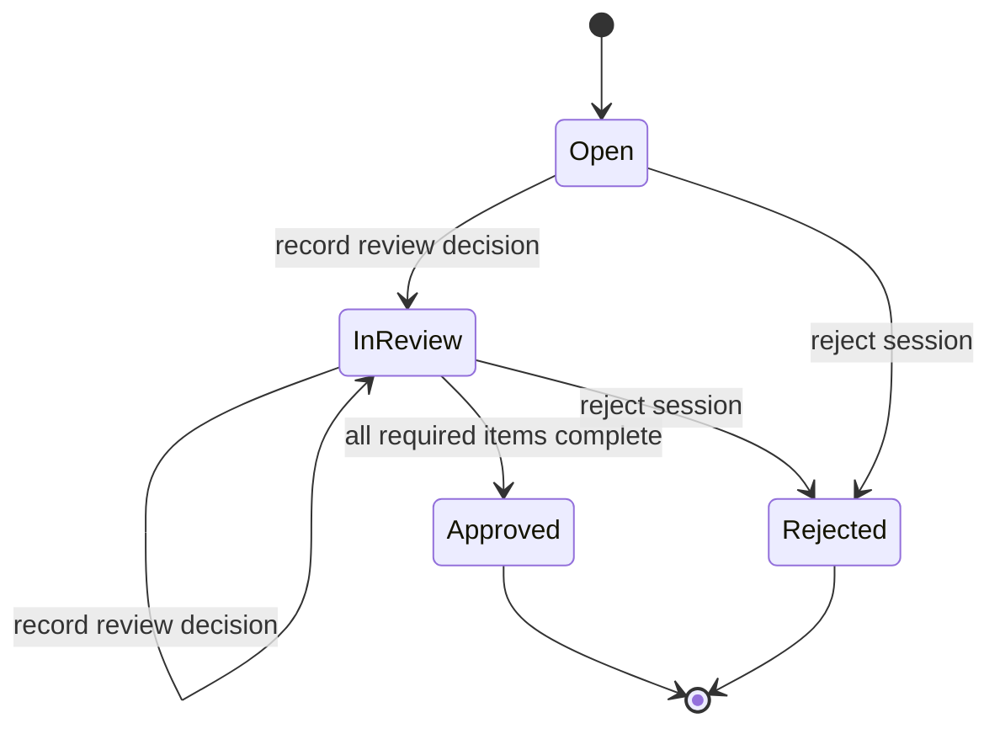

# Review Workflow Diagram

```mermaid
stateDiagram-v2
  [*] --> Open
  Open --> InReview: record review decision
  InReview --> InReview: record review decision
  InReview --> Approved: all required items complete
  InReview --> Rejected: reject session
  Open --> Rejected: reject session
  Approved --> [*]
  Rejected --> [*]
```

The executable Review Session state machine and approval rules are documented in [review and deployment](../06-review-deployment.md).
