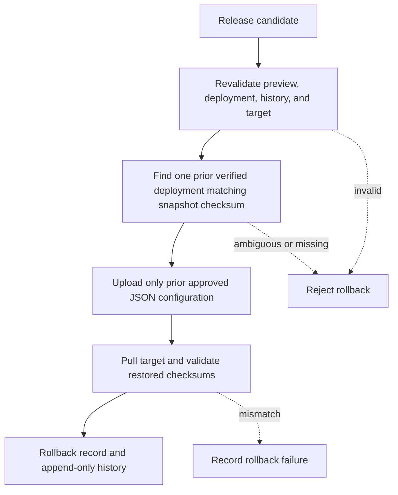

# Rollback Workflow Diagram

```mermaid
flowchart TD
  Release[Release candidate] --> Revalidate[Revalidate preview, deployment, history, and target]
  Revalidate --> Match[Find one prior verified deployment matching snapshot checksum]
  Match --> Restore[Upload only prior approved JSON configuration]
  Restore --> Verify[Pull target and validate restored checksums]
  Verify --> Record[Rollback record and append-only history]
  Revalidate -. invalid .-> Reject[Reject rollback]
  Match -. ambiguous or missing .-> Reject
  Verify -. mismatch .-> Failed[Record rollback failure]
```

See [rollback workflow](../../ai/rollback-workflow.md).
