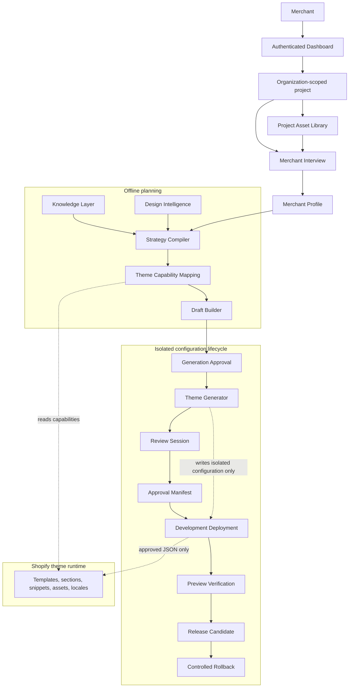

# System Architecture Diagram

```mermaid
flowchart TD
  Merchant[Merchant] --> Dashboard[Authenticated Dashboard]
  Dashboard --> Project[Organization-scoped project]
  Project --> Assets[Project Asset Library]
  Project --> Interview[Merchant Interview]
  Assets --> Interview
  Interview --> Profile[Merchant Profile]
  subgraph Planning[Offline planning]
    Knowledge[Knowledge Layer]
    Intelligence[Design Intelligence]
    Compiler[Strategy Compiler]
    Mapping[Theme Capability Mapping]
    Draft[Draft Builder]
    Knowledge --> Compiler
    Intelligence --> Compiler
    Compiler --> Mapping
    Mapping --> Draft
  end
  Profile --> Compiler
  subgraph Governance[Isolated configuration lifecycle]
    Approval[Generation Approval]
    Generator[Theme Generator]
    Review[Review Session]
    Manifest[Approval Manifest]
    Deployment[Development Deployment]
    Verification[Preview Verification]
    Release[Release Candidate]
    Rollback[Controlled Rollback]
    Approval --> Generator --> Review --> Manifest --> Deployment --> Verification --> Release
    Release --> Rollback
  end
  Draft --> Approval
  subgraph Runtime[Shopify theme runtime]
    Theme[Templates, sections, snippets, assets, locales]
  end
  Mapping -. reads capabilities .-> Theme
  Generator -. writes isolated configuration only .-> Deployment
  Deployment -. approved JSON only .-> Theme
```

See [system architecture](../02-system-architecture.md).
