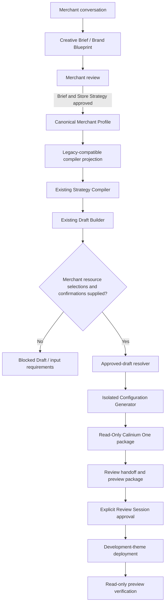

# Theme Generation Pipeline

This document records the actual integration path from approved Creative Director work to an isolated Shopify configuration workspace. It is based on the current repository contracts, not a replacement pipeline.

## Current engines and responsibilities

| Engine | Input | Output | Does not do |
| --- | --- | --- | --- |
| Creative Director | Merchant input and conversation state | Creative Brief and Creative Director Store Strategy | Shopify configuration |
| Merchant Profile adapter | Approved Creative Brief, Store Strategy, and review state | Canonical Merchant Profile | Theme writes |
| Strategy Compiler | Legacy-compatible projection of the canonical profile and catalogs | `calinium-storefront-strategy` | Theme writes |
| Draft Builder | Compiler profile, validated compiler strategy, mappings | `calinium-draft-configuration` | Theme writes or merchant-resource selection |
| Approved-draft resolver | Draft plus explicit merchant configuration | Ready draft | Invented selections |
| Configuration Generator | Ready draft and generation approval | Isolated `output/generation-run-*` configuration | Source-theme modifications or deployment |
| Read-Only Theme Generation Engine | Approved configuration plus Calinium One | Full local Calinium One package and Theme Specification | Shopify writes, uploads, or publication |
| Review Session Engine | Generated workspace | Review handoff/session when explicitly created | Deployment by default |
| Deployment and preview engines | Approved review/deployment records | Development-theme deployment and verification evidence | Production publishing |

## End-to-end flow

## Input requirements, optional fields, and defaults

The Draft Builder is the source of the detailed per-section requirement list. It classifies every setting against the theme capability, safe-default, and content-safety catalogs.

| Input type | Behaviour |
| --- | --- |
| Safe, AI-configurable setting | The Draft Builder may retain the documented schema default. |
| Merchant confirmation setting | The draft remains in the merchant review queue until an explicit confirmation is recorded. |
| Merchant-only resource picker | The draft is blocked until the merchant supplies a reference or explicitly retains the safe empty state where supported. |
| Required media | The draft remains blocked until the merchant supplies an opaque approved asset reference. |
| Product, collection, menu, page, blog, article, or video selection | Never inferred or manufactured. The merchant must select it. |
| Unsupported page blueprint | Retained as unsupported; no template is generated for it. |

The generator accepts only a `Ready` draft with no blocked fields, unresolved merchant requirements, missing required assets, or review queue items. It also requires a valid `calinium-generation-approval` object. The profile adapter does not weaken this check.

## Configuration flow

1. `pipeline/create-merchant-profile.js` validates approval and normalizes the approved handoff.
2. `pipeline/map-merchant-profile.js` validates and projects that profile into the established compiler input schema.
3. The existing Strategy Compiler runs before the Draft Builder because the Draft Builder’s documented input is a validated compiler strategy.
4. The existing Draft Builder creates a conservative draft and requirement queue.
5. `pipeline/resolve-approved-draft.js` applies only explicit merchant selections or explicit safe-empty decisions.
6. The configuration generator writes only `templates/*.json` and `config/settings_data.json` under a new isolated workspace.
7. The Read-Only Theme Generation Engine copies the canonical `apps/theme/` runtime into `storefront-theme/`, overlays only that approved configuration, and writes a schema-validated Theme Specification plus a Shopify-shaped ZIP. It does not modify the source runtime, call Shopify, upload, or publish.
8. `pipeline/preview-package.js` copies review artifacts and generated configuration into `output/preview/<generation-id>/`; it never changes the workspace or source theme.

## Preview, deployment, and verification boundary

The local generation pipeline creates a **review handoff**, not a final approval manifest. It does not deploy, publish, or claim preview verification. The package reports these later stages as blocked until the existing Review Session Engine receives explicit decisions and an approved session can be passed to the Development Theme Deployment Adapter.

This distinction prevents a generated local configuration from being mistaken for a verified development-theme preview.

## Output package

When isolated generation succeeds, `output/preview/<generation-id>/` contains:

- `creative-brief.json`
- `store-strategy.json`
- `merchant-profile.json`
- `draft-configuration.json`
- `generated-theme.json`
- `generated-theme/` with configuration files only
- `validation-report.json`
- `review-handoff.json`
- `merchant-approval-summary.json`
- `generation-summary.md`
- `preview-package.json` with SHA-256 checksums

The preview bundle remains configuration-only. The sibling `output/generation-run-*/storefront-theme/` is the complete read-only Calinium One package for review and later authorized delivery. Neither artifact is a deployment package.

## Source preservation

The Theme Generator snapshots and archives `apps/theme/` before writing the isolated workspace, then checks that the source snapshot is unchanged. Repository integrity validation independently enforces the 182-file runtime baseline. No phase in this flow modifies the Shopify theme directory.

## Related documents

- [Canonical Merchant Profile](merchant-profile.md)
- [Review and deployment lifecycle](06-review-deployment.md)
- [Theme Generator](../ai/theme-generator.md)
- [Read-Only Theme Generation Engine](../ai/read-only-theme-generation.md)
- [Theme generation guide](../guides/theme-generation.md)
