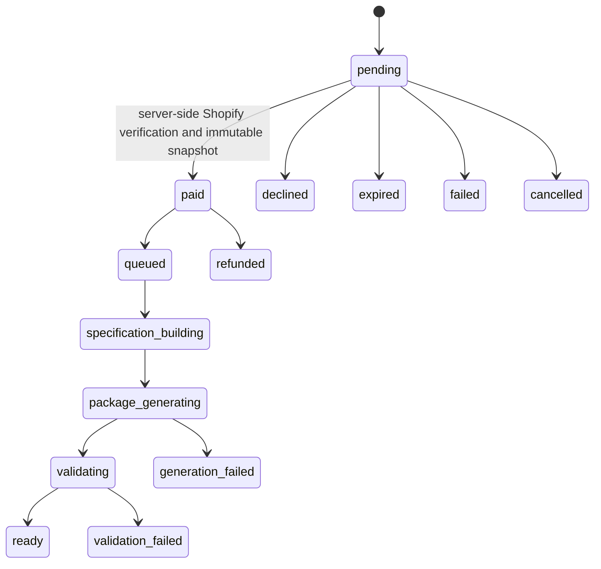

# Paid custom-theme purchase

The custom-theme offer is the only merchant-facing path into Calinium’s read-only theme package generator. It follows the approved Creative Director stages and never changes a Shopify theme.

## Eligibility

The server evaluates eligibility on every order request. It requires an approved Creative Brief and Brand Blueprint, approved Store Strategy, a current explicit Resource Plan approval, selected required assets, no unresolved blocker, and configured price. Shopify resources must still be current and explicitly approved for the assigned project.

An ineligible project receives structured blocked requirements. The dashboard shows these as next steps; it never creates placeholders or assumes a missing approval.

## Purchase and payment

`custom_theme_orders` is project-scoped and idempotent. A pending order records the approved input revision and the displayed versioned price, but not an immutable generation snapshot. Calinium creates the immutable purchased-input snapshot only after the billing provider verifies a paid Shopify purchase server-side. This prevents a redirect, browser state, or client response from authorizing generation.

The default production-safe provider is `shopify_admin_graphql_one_time`. It creates an Admin GraphQL `appPurchaseOneTimeCreate` purchase and returns the merchant to Calinium only after Shopify’s own approval screen. The return is verified against Shopify server-side; it is never accepted as proof of payment by itself. `development_simulator` remains available only when `NODE_ENV` is not `production`, `CALINIUM_PAYMENT_PROVIDER=development_simulator`, and `CALINIUM_PAYMENT_MODE=development_simulator`.

Required configuration names:

```text
CALINIUM_PAYMENT_PROVIDER
CALINIUM_PAYMENT_MODE
CALINIUM_SHOPIFY_BILLING_TEST_MODE
```

The repository contains only an active development/test validation price. A production price must be introduced as a reviewed, versioned catalog entry during release; Calinium refuses a production purchase while no such price is configured.

`config/custom-theme-price-catalog.json` is the canonical price catalog. It includes a product code, display name, one-time billing type, amount, currency, price version, and permitted environments. The pending order snapshots those commercial fields before redirect, so later catalog changes never alter the purchase being verified.

No browser state authorizes payment or generation. Repeated purchase and payment requests use durable idempotency keys; a retry reuses the pending or paid order and cannot create another charge.

## Order lifecycle



The generator reads only the stored snapshot. Editing the project after purchase cannot alter that order’s generated package. If the Calinium One source checksum changes, the order is blocked for review rather than generated from changed inputs.

## Safety boundary

This workflow uses the Milestone 15 read-only generator. It has no Shopify theme API write path, requests no `write_themes` scope, does not upload or publish a theme, and does not change the approved Shopify resources. Shopify resources and uploaded project assets remain separate resource types.

See [delivery](custom-theme-delivery.md) for the download boundary and manual installation instructions, and [Shopify one-time billing](shopify-billing.md) for provider verification, idempotency, and the refund-record boundary.
