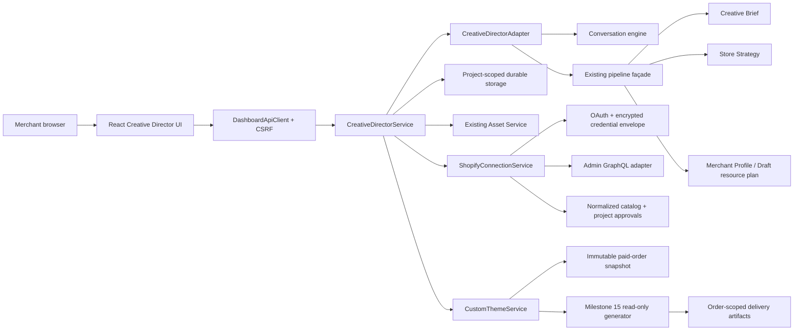
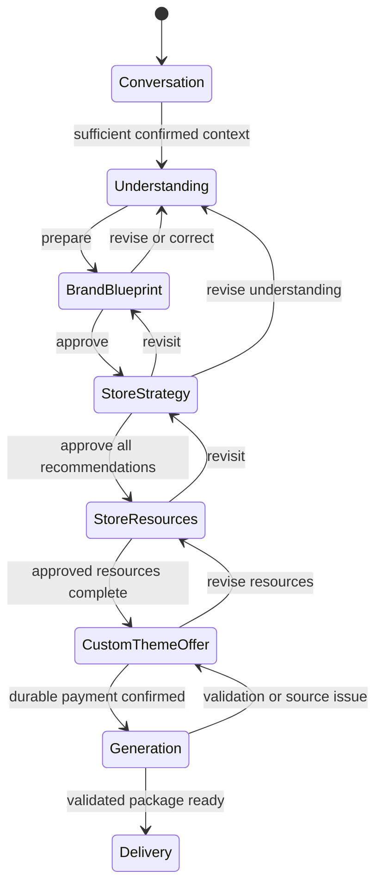

# Merchant Creative Director Dashboard

The Merchant Creative Director Dashboard is Calinium’s merchant-facing orchestration layer. It makes the existing deterministic pipeline understandable without turning the merchant into a theme configurator. In merchant language, the internal Creative Brief is a **Brand Blueprint**.

## Product boundary

The merchant describes the business, audience, goals, and brand feeling. Calinium prepares recommendations. The merchant approves or revises meaningful creative work. The dashboard never asks merchants to select a hero implementation, section order, typography pairing, spacing scale, accessibility policy, or other technical mechanism.

It does not modify `apps/theme/`, Shopify content, source templates, or deployment histories. A merchant may explicitly start a server-only Shopify OAuth connection in Store Resources. The browser sees only safe connection and approval state; it never receives an access token. A local review package is not presented as a live preview.

## Runtime architecture

The browser imports neither AI engines nor storage adapters. `CreativeDirectorAdapter` is the server-only seam that imports the public conversation and pipeline interfaces. `CreativeDirectorService` owns authorization, durable lifecycle state, activity history, and the approval transition rules. Existing engine modules remain their authoritative source of business reasoning.

## Routes

| Route | Purpose |
| --- | --- |
| `/` | Calm landing: begin a project or continue a saved design conversation. |
| `/projects/new` | Creates the durable project before design work begins. |
| `/projects/:projectId/design` | Full Creative Director journey. |
| `/projects/:projectId/assets` | Existing project Asset Library used by Store Resources. |
| `/projects/:projectId` | Project context and access to existing interview/profile surfaces. |

The existing authenticated dashboard, legacy catalog-driven interview, project profile, settings, and Asset Library remain available. The Creative Director journey is a new additive route, not a replacement for those flows.

## Durable session model

`creative_director_sessions` is an additive SQLite/PostgreSQL migration with one session per project. It serializes only reviewable state:

- conversation state and transcript;
- Creative Brief and Store Strategy;
- explicit review decisions;
- canonical Merchant Profile when the existing pipeline can prepare it;
- resource plan, selected merchant references, and approval evidence;
- real generation events and review-package preview state.

The session is project-scoped and every read/write goes through the established organization membership checks. A page refresh or a later login resumes the same record. Shopify connections, credential envelopes, synchronization runs, resource approvals, and preview targets are separate durable records. Only safe approved resource references are copied into the Creative Director generation context; no credential or raw API record enters the session.

## Approval state machine

The API permits only backward revisits through `setStage`; no client can skip a pending approval by posting a later stage. The Custom Theme Service additionally requires a current approved Resource Plan, a configured price, and a durable paid order. It captures an immutable snapshot before invoking the existing read-only pipeline. It does not upload, modify, or publish a Shopify theme. See [Paid custom-theme purchase](custom-theme-purchase.md).

## Visual and accessibility system

The dashboard extends the existing dashboard styles with `creative-director-*` and `cd-*` component scopes. It uses the application’s existing typography, buttons, focus treatment, and responsive foundations rather than introducing a second design system. Motion communicates a state change only; the conversation scroll and CSS transitions respect `prefers-reduced-motion`.

Every stage has one `h1`, a labelled progress stepper, real buttons, visible focus states, keyboard-reachable review controls, `meter` semantics for brief confidence, live announcement only for newly added conversation messages, and status text that does not rely on color alone. The responsive layout collapses at narrow widths without removing access to the journey controls.

## Current scope

The dashboard can collect and review creative direction, preserve it across sessions, connect an explicitly chosen Shopify store server-side, synchronize a minimized resource catalog, and require merchant approval before an item becomes a project input. It can prepare a preview record only for a merchant-approved existing unpublished/development theme and only shows a URL Shopify actually returns. Upload, deployment, preview verification, release, and rollback remain distinct existing workflows. See [Shopify connection and approval](shopify-connection.md).
