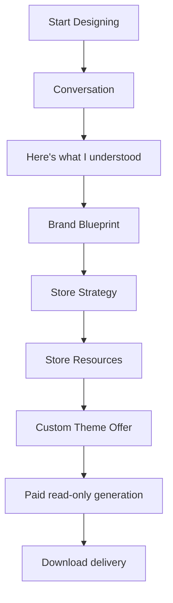

# Merchant Creative Director Flow

The Creative Director flow is designed as a conversation with a calm, experienced collaborator—not a configuration wizard. A merchant sees one primary decision at a time.

## 1. Start Designing

The landing screen offers two simple choices: **Start Designing** and **Browse Premium Themes**. It has no feature matrix or technical setup. A new project is created before a session starts so the work belongs to the merchant’s organization and can resume on another device.

## 2. Conversation

Calinium begins with the deterministic engine’s greeting:

> Hi, I'm Calinium.
> I'll help you design a Shopify storefront.
> What do you sell?

The UI renders one engine question at a time. The merchant may write an answer, choose **I don’t know**, choose **You decide**, pause with **Continue later**, restart, or correct later understanding. The UI does not interpret answers; each accepted message is sent to the server adapter and saved with the resulting engine state and transcript.

## 3. Understanding

The merchant sees **Here’s what I understood** before anything is generated. Business, audience, goals, brand, products, and positioning appear as short editable cards. Editing invokes the engine-owned correction path, clears downstream recommendations, and records a new Calinium understanding message.

## 4. Brand Blueprint

The internal Creative Brief is shown as a Brand Blueprint. Business, audience, brand, goals, content, assumptions, unknowns, and a confidence meter are presented as readable cards. The merchant can approve, edit, or request a revision. Assumptions stay visibly distinct from confirmed context.

## 5. Store Strategy

Calinium presents homepage, navigation, typography, color, product-page, collection, and motion recommendations with concise reasons. Each recommendation can be approved, rejected, or revised. The Strategy cannot progress until outstanding recommendation revisions are resolved.

## 6. Store Resources

Only after the creative direction is approved does Calinium identify the real resources the existing planning pipeline needs. The screen groups requests such as product selections, collections, navigation, images, video, and content; it does not expose raw setting references. It links to the project Asset Library for uploaded files.

Shopify products, collections, menus, media, and eligible preview themes remain unavailable until the merchant explicitly connects a store, refreshes its resources, and approves the current records for this project. The screen states that constraint and blocks generation rather than guessing or inventing merchant resources. Optional fields may be intentionally left empty; required assets still require an approved project asset. See [Shopify connection and resource approval](shopify-connection.md).

## 7. Custom Theme Offer and generation

Calinium presents the approved direction, real selected resources, output format, and server-configured price. The merchant explicitly chooses **Purchase and Generate Theme**. No eligibility, resource synchronization, or approval event can start generation automatically.

Only a durable payment event permits generation. The service snapshots the approved inputs and then reports only actual pipeline stages: preparing the specification, assembling the isolated configuration, validating it, and preparing a download. It does not simulate a percentage, timer, Shopify upload, or theme update. If resources are incomplete, it returns to Store Resources with a specific reason.

## 8. Delivery

When validation succeeds, the merchant can download a Shopify-shaped theme ZIP, Theme Specification, and validation report. The delivery screen explains how to add the ZIP as a new unpublished theme manually. It states clearly that Calinium has not modified or published the merchant’s Shopify theme. Preview and deployment remain separate guarded workflows.

## Recovery and safety

Every accepted transition is persisted server-side. Reopening the project resumes the last durable stage. The service rejects forward stage jumps and tenant access violations. Theme source, merchant Shopify data, and deployment records are outside this flow.
