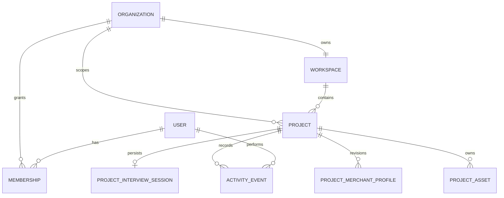

# Projects

A project is Calinium’s durable unit of merchant work. One organization can own many projects, and each project represents one business or brand.

## Project contract

[`calinium-project.schema.json`](../../schemas/calinium-project.schema.json) records the project name, business name, two-letter country code, optional website, optional Shopify store URL, and optional visual icon. A Shopify store connection is a separate explicit, encrypted, organization-owned record that must be assigned to a project; it does not modify the merchant’s store. See [Shopify connection and resource approval](shopify-connection.md).

Creation requires `project:create` in the owner’s default workspace. Queries always combine the project identity with an active organization membership, so a browser cannot access a project by guessing an ID from another organization.

## Project-owned records

The original engine-owned session schema remains untouched. The Dashboard stores it inside [`calinium-project-interview-session.schema.json`](../../schemas/calinium-project-interview-session.schema.json), which adds only project ownership and the active interview category. On confirmation, the generated canonical Merchant Profile is saved in [`calinium-project-merchant-profile.schema.json`](../../schemas/calinium-project-merchant-profile.schema.json) and becomes the project’s current profile pointer.

The Project page exposes these current states:

- Merchant Interview: start or resume.
- Merchant Profile: view when confirmed.
- Activity: durable, append-only operational history.
- Assets: open the project-scoped Asset Library.
- Strategy and Theme: locked; no compiler or generator invocation exists here.

## Cross-device recovery

The server loads an in-progress project interview from durable storage for any authenticated member with `interview:edit`. The active category, engine session state, autosaved answer patches, and completed profile are not derived from `localStorage`; logging in on another device restores the same project record.
