# Shopify one-time billing

Milestone 17 connects Calinium’s paid custom-theme offer to Shopify Admin GraphQL one-time app purchases. It preserves the existing Creative Director, resource approval, read-only package generator, review, preview, deployment, and release boundaries.

It does **not** upload, install, modify, or publish a Shopify theme. The generated package remains a merchant download for manual installation.

## Boundary and prerequisites

A custom-theme purchase starts only after the server confirms all of the following for the current project:

- Creative Brief and Brand Blueprint approved;
- Store Strategy approved;
- current Store Resources explicitly approved;
- required uploaded and Shopify resources selected and still available;
- no unresolved strategy blocker; and
- a current, versioned custom-theme price.

An embedded Shopify session alone, a return URL, a project edit, resource synchronization, or a previously approved project never creates a purchase or starts generation.

The Shopify connection is still read-only for theme operations. The existing scope set contains no `write_themes`, and the billing adapter has no theme GraphQL mutation.

## Flow

```mermaid
stateDiagram-v2
  [*] --> Eligible: approved project inputs
  Eligible --> Pending: explicit “Purchase and Generate Theme”
  Pending --> AwaitingApproval: Shopify confirmation URL issued
  AwaitingApproval --> Pending: merchant returns; server rechecks provider
  Pending --> Paid: matching Shopify AppPurchaseOneTime is ACTIVE
  Pending --> Declined
  Pending --> Cancelled
  Pending --> Expired
  Pending --> Failed
  Paid --> Queued: immutable input snapshot created once
  Queued --> Generating
  Generating --> Ready: package validation succeeds
  Generating --> ValidationFailed
  Generating --> GenerationFailed
  Paid --> Refunded: verified administrative record
```



The merchant’s browser receives a confirmation URL only as the immediate response to the explicit purchase request. It is not persisted in normal order summaries or exposed in generated package artifacts. After return, the embedded dashboard authenticates normally and requests server-side verification; a redirect never marks an order paid.

## GraphQL provider

`ShopifyOneTimeBillingProvider` is the default unless the server explicitly selects the development simulator. It centralizes the API version in `apps/dashboard/server/shopify/constants.cjs` (currently `2026-07`) and calls:

- `appPurchaseOneTimeCreate` to prepare Shopify’s merchant approval page;
- a `node(id: …)` query for `AppPurchaseOneTime` to verify the purchase after return.

Calinium verifies the connected shop, AppPurchaseOneTime global ID, product name, exact integer price, currency, and test/live marker. Only a provider status of `ACTIVE` becomes the Calinium `paid` state. Pending, declined, cancelled, expired, malformed, inaccessible, or mismatched purchases cannot generate a package.

The configured scope list remains the smallest existing read-only resource set. Billing uses the installed app’s Admin GraphQL session and does not request customer, order, payment, or theme-writing scope.

## Price catalog

[`config/custom-theme-price-catalog.json`](../../config/custom-theme-price-catalog.json) is the canonical commercial catalog. Each product has a stable code, display name, `one_time` billing type, integer minor-unit amount, ISO currency, price version, activation flag, and allowed environments.

The repository includes only the `$1.00 USD` development/test validation entry. It intentionally contains **no active production price**. Before a production release, an authorized release process must add a reviewed active production price/version; never set a price in browser code or an environment variable. Calinium copies the product code, display name, amount, currency, and price version into the pending order before redirect. Later catalog changes cannot change that order.

## Durable records and idempotency

Calinium stores separate records for:

1. the project-scoped custom-theme order;
2. the provider billing reference;
3. the immutable purchased-input snapshot, created only after verified payment;
4. generation runs; and
5. generated artifact references.

The Calinium order ID is independent from Shopify’s AppPurchaseOneTime ID. A unique project/idempotency key and a partial unique index for an active approved-input checksum prevent duplicate orders. Provider events use a durable unique event ID. A compare-and-swap generation claim prevents duplicate package runs after a replayed return or concurrent worker.

The SQLite development adapter serializes its one local connection’s transactions; PostgreSQL relies on the same unique constraints and compare-and-swap transition. Retrying a paid order reuses its snapshot and never creates another purchase.

## Development simulator

`development_simulator` is a deterministic test/local adapter only. It is available solely when both of these are true:

```text
NODE_ENV is not production
CALINIUM_PAYMENT_PROVIDER=development_simulator
CALINIUM_PAYMENT_MODE=development_simulator
```

It is unavailable in production by design. It has no Shopify API access and cannot represent a production payment.

## Configuration

Use names only; never commit values:

```text
CALINIUM_PAYMENT_PROVIDER
CALINIUM_PAYMENT_MODE
CALINIUM_SHOPIFY_BILLING_TEST_MODE
CALINIUM_APPLICATION_URL
CALINIUM_SHOPIFY_CLIENT_ID
CALINIUM_SHOPIFY_CLIENT_SECRET
CALINIUM_SHOPIFY_TOKEN_ENCRYPTION_KEY
```

For non-production development stores, `CALINIUM_SHOPIFY_BILLING_TEST_MODE=true` requests a Shopify test purchase. The server defaults it to test mode outside production. Production should set pricing and billing configuration through a reviewed release process, not by exposing a client-side switch.

## Refunds and recovery

Calinium does not automatically issue refunds. A server-only billing-operations call can record a separately verified administrative refund reference. That record is append-only, marks the commercial order `refunded`, and never deletes an already delivered package. A future administrative refund UI must enforce its own operator authorization and retain the provider verification evidence.

If an order’s approved inputs change while Shopify is confirming payment, Calinium records payment but blocks generation. The merchant must return to Store Resources and create a new explicitly approved commercial intent; it never substitutes mutable inputs into a paid order.

## Validation

```sh
npm run validate:shopify-billing
npm run test:shopify-billing
```

These checks validate the catalog, schemas, paid-only snapshot boundary, provider normalization, replay protection, refund record model, no-write invariant, and source-theme inventory. A live purchase requires an explicit merchant click in Shopify’s confirmation screen; no automated test or background request may create one.

See [the paid custom-theme flow](custom-theme-purchase.md), [delivery](custom-theme-delivery.md), and [Shopify connection security](shopify-security.md).
