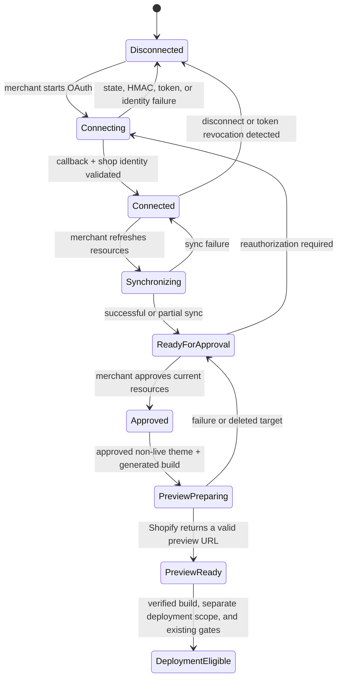

# Shopify connection and resource approval

The Shopify connection adapter lets a merchant connect a store, review its normalized resources, and explicitly approve only the items a Calinium project may use. It is an additive dashboard capability. It does not replace the Creative Director, Merchant Profile adapter, Draft Builder, generator, review session, preview verification, deployment adapter, or release manager.

## Boundaries

- The browser calls authenticated dashboard endpoints only. It never imports the Admin API adapter, storage driver, OAuth secret, or credential envelope.
- The server encrypts access tokens with AES-256-GCM before persistent storage. Missing encryption configuration fails the connection instead of storing a token in plaintext.
- A connected store belongs to an organization, then must be assigned to a project. Assignment is not automatic for every project in that organization.
- Synchronization is discovery only. It stores minimized, normalized catalog metadata; it never imports customers, orders, payment data, or raw GraphQL payloads.
- A synchronized record is not a generator input. Each project requires a current explicit approval with the resource revision it approved.
- Uploaded project assets remain independent from Shopify resources.

## Merchant flow

1. In **Store Resources**, the merchant enters a `myshopify.com` store domain and is redirected to Shopify.
2. Shopify returns to the server-only callback. State, nonce, HMAC, timestamp, requested scope, and shop identity are verified before a credential is saved.
3. The merchant refreshes resources. The dashboard shows ordinary labels and previews, never remote IDs, scopes, or credentials.
4. The merchant chooses **Approve**, **Do not use**, or **Remove approval** for products, collections, navigation, media, and eligible theme targets.
5. Only current approved records can satisfy Store Resources selections. A remote edit, deletion, disconnect, unavailable connection, or stale revision blocks the affected selection without silently deleting approved strategy work.

## Server routes

All listed routes use the existing dashboard session, project authorization, JSON error format, and CSRF protection for mutations. The OAuth callback is the narrow exception: Shopify authenticates it with state, HMAC, timestamp, and nonce validation.

| Route | Method | Purpose |
| --- | --- | --- |
| `/api/projects/:projectId/shopify/connections/start` | POST | Starts OAuth for an approved purpose. |
| `/api/shopify/oauth/callback` | GET | Validates Shopify’s callback and redirects back to the assigned project. |
| `/api/projects/:projectId/shopify/connections` | GET/POST | Lists eligible organization connections or assigns one. |
| `/api/projects/:projectId/shopify/connection` | GET | Reads the project assignment and safe connection status. |
| `/api/projects/:projectId/shopify/connection/health` | POST | Rechecks identity, token health, and discovery scopes. |
| `/api/projects/:projectId/shopify/connection/sync` | POST | Performs rate-aware, cursor-paginated resource sync. |
| `/api/projects/:projectId/shopify/connection/disconnect` | POST | Deletes the credential envelope and invalidates approvals. |
| `/api/projects/:projectId/shopify/resources` | GET | Lists normalized resources and this project’s approval state. |
| `/api/projects/:projectId/shopify/resources/:resourceId/approval` | POST | Approves or rejects an eligible current resource. |
| `/api/projects/:projectId/shopify/resources/:resourceId/revoke` | POST | Revokes an existing approval. |
| `/api/projects/:projectId/shopify/preview` | GET/POST | Reads or safely prepares a preview record. |
| `/api/projects/:projectId/shopify/preview/eligibility` | GET | Reports read-only eligibility for a synchronized theme. |
| `/api/shopify/webhooks` | POST | Receives a raw-body HMAC-verified Shopify webhook; no dashboard session is accepted here. |

## Connection lifecycle and recovery

The connection may require reauthorization if Shopify rejects the token, the granted scope set is incomplete, or the identity cannot be verified. Sync is idempotent and paginated. A partial sync persists resources that Shopify returned and records safe failure codes for unavailable types; it does not invent empty replacements.

Disconnecting a store deletes the encrypted credential envelope, marks every project assignment disconnected, and invalidates approvals bound to that connection. Existing strategy and Blueprint records are preserved, but affected Store Resources selections must be replaced before generation continues.

See [security and environment requirements](shopify-security.md), [resource normalization](shopify-resources.md), and [preview boundaries](shopify-preview.md).

For Shopify CLI linking, development-store validation, expiring offline credentials, webhook recovery, and the strict read-only Milestone 14 boundary, see [Shopify live validation](shopify-live-validation.md).
