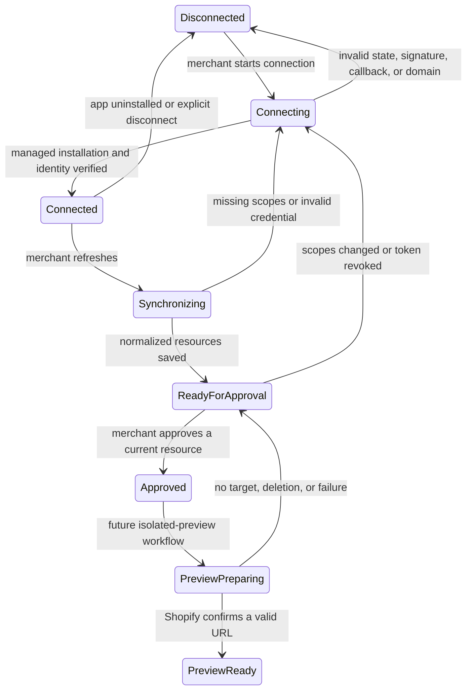

# Shopify app linking and live development-store validation

Milestone 14 connects Calinium’s existing server-only Shopify connection boundary to the released **Calinium** app configuration without changing a merchant theme. It is deliberately read-only: the declared scopes are `read_content`, `read_files`, `read_markets`, `read_online_store_navigation`, `read_products`, and `read_themes`. `write_themes` is neither requested nor activated in this milestone.

## Architecture



The browser uses authenticated project routes only. `ShopifyConnectionService` owns OAuth, encrypted credentials, scope checks, sync, and project-scoped approvals. `ShopifyAdminApiAdapter` is the only live Admin GraphQL boundary; `DeterministicShopifyAdapter` remains the test substitute. Webhooks use their raw body and HMAC before any JSON is parsed. The server saves only a delivery checksum and sanitized result, never a raw sensitive payload.

## Local development setup

1. Copy `apps/dashboard/.env.example` to a private `apps/dashboard/.env` and provide values from the Shopify Dev Dashboard. Generate separate 32-byte encryption and dashboard-session secrets. Calinium refuses a Shopify connection if the OAuth or encryption configuration is incomplete. The server resolves this file from `apps/dashboard/server`, not from the command working directory, so Shopify CLI may launch the web command from another directory safely. The development startup message reports only whether the two required secrets are configured; it never prints their values.
2. Copy `shopify.app.development.toml.example` to the ignored `shopify.app.development.toml`; replace only the client-ID placeholder. Do not commit it.
3. Authenticate Shopify CLI, then link the existing Dev Dashboard app (not a starter app):

   ```sh
   shopify app config link --client-id "$CALINIUM_SHOPIFY_CLIENT_ID" --config development
   shopify app config validate --config development
   shopify app dev --config development
   ```

   Shopify CLI discovers `apps/dashboard/shopify.web.toml` and runs its existing `npm run dev` command. It injects the secure temporary URL and active public app credentials as `APP_URL`/`HOST`, `SHOPIFY_API_KEY`, and `SHOPIFY_API_SECRET` for that process. Calinium treats these values as ephemeral: they take precedence during the CLI session without replacing the released production URL or private `.env` values permanently. The server binds to a local interface, not `HOST`; `HOST` is a public tunnel URL. Vite permits only the hostname derived from that URL, rather than disabling host validation.
4. Install the app into a designated development store and open it from Shopify Admin. The embedded dashboard verifies the App Bridge session and opens the Creative Director landing screen directly; it does not show Calinium email/password sign-in. Managed installation remains enabled; legacy installation remains disabled.

The committed staging and production **example** files document configuration only. They are not credentials, linked configurations, or a claim that `app.calinium.com` is deployed.

## Credentials and sessions

- OAuth callback state is one-time, hashed, nonce-bound, and expires after ten minutes.
- Callback HMAC, timestamp, callback shop domain, and returned shop identity are checked before a credential is saved.
- Offline credentials use AES-256-GCM envelopes. Calinium does not invent a refresh flow: if Shopify’s issued token is no longer valid, missing, corrupt, or undecryptable, the next signed embedded launch exchanges a current App Bridge session token again; otherwise the merchant is asked to reconnect.
- Access tokens, client secrets, encryption keys, signed embedded-session data, and raw GraphQL responses are never returned from dashboard APIs, included in activity events, or written to generated artifacts.
- The dashboard shell emits only the public Shopify API key and Shopify’s official App Bridge script when it runs under Shopify CLI. App Bridge obtains a short-lived session token for each in-flight API request; the browser does not persist it. The server verifies its signature, audience, expiry, issuer, and shop destination before using it as embedded-context evidence. Calinium’s existing HTTP-only account session and project authorization remain the data-access boundary.
- Embedded dashboard cookies use `SameSite=None`, `Secure`, and `Partitioned`; standalone local dashboard cookies retain the existing `SameSite=Lax` behavior. The server returns frame-safe CSP headers permitting Shopify Admin and Shopify store frames only.
- Dashboard sessions use a server-side HMAC when `CALINIUM_DASHBOARD_SESSION_SECRET` is configured. Existing pre-secret sessions retain a legacy lookup only while they expire, preserving migration safety.
- Embedded Shopify sign-in requires that dashboard-session secret and the token-encryption key even in local development. The first app launch for an installed shop uses Shopify managed-install token exchange to obtain an expiring offline credential if no valid encrypted envelope exists; later launches reuse and refresh that envelope server-side. The short-lived App Bridge token is not persisted.
- A `shopify_embedded_identities` record maps Shopify’s signed user subject and shop domain to a Calinium user in the same shop-scoped organization. The initial Shopify identity is an owner; later identities are editors. Every embedded API request checks this mapping, preventing a valid session for one shop from using a dashboard cookie issued for another.

## Granted scopes and resource sync

After installation, Calinium queries `currentAppInstallation.accessScopes`; configured scopes alone do not establish readiness. Missing scopes block synchronization. Unexpected scopes are reported safely but do not grant additional capability.

Products, variants, media, collections, menus, files, markets, shop identity, and theme metadata are cursor-paginated and stored as minimized normalized records. A changed revision marks an existing approval **stale** rather than silently replacing it. A deleted or inaccessible record becomes unavailable and blocks affected project selections. The main theme is never an eligible preview target.

## Webhooks and recovery

The local configuration subscribes to `app/uninstalled`, `app/scopes_update`, and `themes/delete` for API version `2026-07`. The `/api/shopify/webhooks` route verifies Shopify’s HMAC against the raw body, deduplicates on `X-Shopify-Webhook-Id`, and records an append-only sanitized delivery event.

- Uninstall deletes the encrypted envelope, disconnects assignments, and invalidates approvals.
- Scope updates recalculate missing scopes and require reconnecting when discovery scopes were removed.
- Theme deletion invalidates its project approvals and any future preview eligibility.

If a local tunnel restarts, run `shopify app dev` again, let CLI update the development URLs, and reconnect the development store. Network, throttle, permission, and GraphQL failures return sanitized recoverable states; no response is invented.

## Embedded dashboard recovery

If Shopify Admin shows a blank embedded page, restart the linked app from the repository root:

```sh
npm exec --yes --package @shopify/cli@latest -- shopify app dev --config development
```

Wait until Shopify CLI reports that the dashboard web process is ready, then reload the embedded app in Shopify Admin. The root route must return the Calinium React shell with the App Bridge meta tag and script, and `/api/health` must return the dashboard health result through the CLI tunnel. With the required private session and encryption keys configured, `/api/auth/embedded` creates or resumes the shop workspace and the Creative Director landing screen appears without an email/password form. Missing security configuration deliberately produces a safe embedded-session error instead of falling back to password authentication.

## Read-only preview and deployment boundary

Milestone 14 only lists theme metadata and determines eligibility: `eligible`, `ineligible-main-theme`, `ineligible-demo-theme`, processing states, missing scope, and disconnected-store. It cannot create, duplicate, upload, replace, publish, or delete a theme. A future isolated preview/upload workflow must separately obtain explicit merchant approval and the appropriate write permission; deployment and release safeguards remain unchanged.

## Tests

Run deterministic checks:

```sh
node scripts/validate-shopify-live-integration.js
node scripts/test-shopify-live-integration.js
```

The optional live test runs only when all of these are explicitly set: `CALINIUM_SHOPIFY_INTEGRATION_SHOP_DOMAIN`, `CALINIUM_SHOPIFY_INTEGRATION_ACCESS_TOKEN`, and `CALINIUM_SHOPIFY_INTEGRATION_ALLOW_READ_ONLY=true`. It only reads installation identity; it creates, updates, publishes, or deletes nothing. Use a development store, never a production merchant store.

## Milestone 15 handoff

Milestone 15 may add an isolated preview workspace only after a verified development-store connection, current resource approvals, an approved build, and a separate review of narrowly scoped theme-writing permission. It must not relax this read-only boundary.
