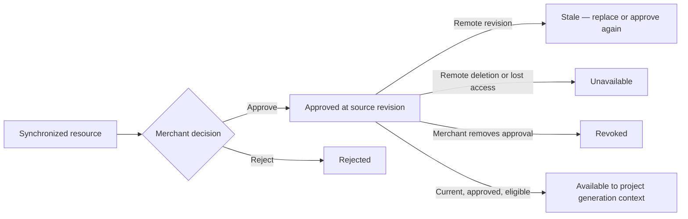

# Shopify resource synchronization and approval

## Normalized catalog

`ShopifyConnectionService` is the server-only coordinator. `ShopifyAdminApiAdapter` centralizes Admin GraphQL calls, cursor pagination, one bounded rate-limit retry, GraphQL user-error handling, permission failures, and API-version configuration. React components never submit GraphQL queries.

The durable catalog retains only the minimum metadata needed for review and later approved references:

- shop identity and public storefront address;
- product label, handle, status, preview, variants, and media references;
- collection label, handle, and preview;
- navigation menu label and summarized items;
- eligible Shopify file/media metadata;
- market metadata relevant to storefront planning;
- theme label, role, and preview address;
- stable remote GraphQL ID, local record ID, source revision, availability, and synchronization timestamps.

It does not persist raw Shopify API responses, orders, customers, payments, access tokens, or invented fallback records. A sync with no results remains an honest empty state.

## Approval lifecycle



Approvals are project-scoped. The same resource can be approved for one project and remain unavailable to another unless that project has its own explicit store assignment and approval. Resolution checks all of the following:

1. project and organization assignment;
2. resource type requested by the current field;
3. resource existence and availability;
4. approval eligibility;
5. approval status is `approved`;
6. approval source revision equals the resource’s current source revision.

The Creative Director persists only safe `dashboard://projects/.../shopify-resources/...` references in its generation context. It resolves those references again immediately before generation. This keeps stale, revoked, deleted, or cross-project records from becoming generator inputs.

Uploaded project assets are a distinct source. They continue to work without a Shopify connection and are not converted into remote Shopify resources.

## Testing and recovery

Run the deterministic adapter test through:

```sh
node scripts/test-shopify-connection-adapter.js
node scripts/validate-shopify-connection-adapter.js
```

The suite covers OAuth state/HMAC handling, encrypted credential persistence, no-token public records, cross-tenant denial, cursor pagination, partial failures, approval revision invalidation, disconnect cleanup, and safe preview behavior. For a real store, use a development app and the environment variables in [Shopify security](shopify-security.md); do not use production credentials in fixtures or test logs.
