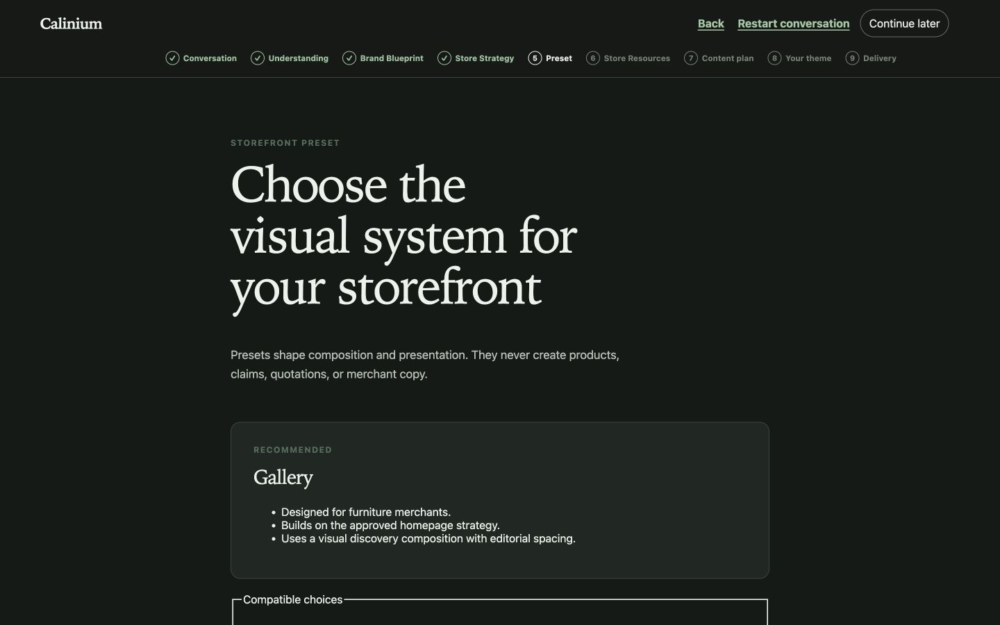
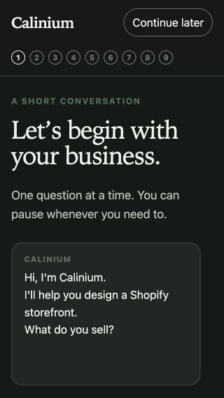

# Calinium Beta Release Candidate 1

Release candidate: `calinium-beta-rc.1-2026-08-02`

Target: Calinium One 1.0

Decision: **No-Go — blocked by multiple issues.** The deterministic generator, preset catalog, Approved Block Plan transport, adapters, read-only packaging, package validation, and local dashboard application are passing. A private merchant beta must wait for live Shopify Partner billing/distribution evidence and for manual development-store storefront, Theme Editor, browser, accessibility, and performance QA.

## Evidence boundary

This record distinguishes verified behavior from untested behavior. It does not treat generated configuration as visual storefront evidence, an installed browser as an executed browser test, or implementation-ready billing code as a successful live Shopify charge.

The repository has no Git metadata. File scope and source preservation were checked with explicit paths, pre/post source hashes in the generator suites, and task-output inspection; repository-wide Git diff claims are not possible.

## Release gates

| Gate | Result | Evidence |
| --- | --- | --- |
| Six-preset deterministic generation | Pass | Atelier, Maison, Gallery, Ritual, Essential, and Signal each generated twice; semantic output was stable; Theme Check passed. |
| Approved Block Plan and adapters | Pass | Plan schema, transport, evidence/editorial adapters, and commerce materialization suites passed. |
| Read-only packaging | Pass | No upload, publish, Shopify write scope, source mutation, or retained task workspace was detected. |
| Direct Theme Check | Pass | 133 theme files inspected; zero offenses. |
| Dashboard regression suite | Pass | 29 test files; 116 tests passed and 1 skipped. |
| Security/billing-focused dashboard tests | Pass | 8 test files; 38 tests passed and 1 skipped. |
| Dashboard production build | Pass | Vite production build completed. |
| Local Creative Director journey | Partial | Conversation through Store Resources, preset approval, continue-later, and resume were exercised. Resource gating correctly stopped progress without approved Shopify resources. |
| Storefront browser/viewport matrix | Not verified | No authenticated storefront preview was available. |
| Theme Editor lifecycle | Not verified | `shopify theme dev` reached the linked development store but required an unavailable storefront password. |
| Storefront Lighthouse | Not verified | No live generated storefront was available. |
| Billing/distribution | Blocked | Code and development simulation pass; Partner ownership/distribution, active production price, and live charge are not proven. |

## Preset release coverage

The preset architecture suite verified deterministic recipe/configuration output, omission behavior, read-only packages, and Theme Check for all presets. It did not provide rendered visual QA.

| Preset | Verified generated homepage composition | Verified omissions |
| --- | --- | --- |
| Atelier | full-screen-hero, craftsmanship, featured-collection, newsletter | founder-story, testimonials |
| Maison | full-screen-hero, featured-collection, newsletter | lookbook, testimonials, founder-story, craftsmanship |
| Gallery | full-screen-hero, lookbook, featured-collection, editorial-grid, newsletter | story-banner |
| Ritual | full-screen-hero, materials, featured-collection, faq, newsletter | testimonials |
| Essential | full-screen-hero, featured-collection, newsletter | unsupported optional/editorial sections from the fixture |
| Signal | full-screen-hero, product-highlights, faq, newsletter | product-carousel, product-comparison, testimonials |

## Local browser evidence

The in-app Chromium-like browser exercised the local production dashboard at all required viewport dimensions. It is not evidence for Firefox, Safari/WebKit, or a generated storefront.

Verified at `320×568`, `375×667`, `390×844`, `768×1024`, `1024×768`, `1366×768`, `1440×900`, and `1920×1080`:

- no horizontal overflow on the Store Resources stage;
- one H1 with valid H1/H2/H3 order;
- stage content did not sit beneath the sticky progress header after the focus fix;
- no unnamed visible form controls or duplicate DOM IDs;
- resume returned to the saved Store Resources state;
- visible focus styling was present on a labeled control.

Actual 200%/400% browser zoom, complete keyboard traversal, screen-reader announcements, RTL, reduced-motion emulation, long translations, touch interactions, and storefront pages remain manual QA requirements.

## Accessibility and performance

Lighthouse was run only against the local production dashboard sign-up route. These are actual measurements, but they are not storefront scores.

| Profile | Performance | Accessibility | Best Practices | SEO | FCP | LCP | CLS | TBT | Transfer |
| --- | ---: | ---: | ---: | ---: | ---: | ---: | ---: | ---: | ---: |
| Mobile | 88 | 100 | 96 | 82 | 3.0 s | 3.2 s | 0 | 0 ms | 400 KiB |
| Desktop | 100 | 100 | 96 | 82 | 0.6 s | 0.6 s | 0 | 0 ms | 400 KiB |

INP was unavailable in the navigation-only run. The Best Practices deduction came from the expected unauthenticated `/api/auth/me` 401 logged during sign-up bootstrap. SEO deductions were a missing meta description and an invalid SPA response at `/robots.txt`; these are low-severity findings for the embedded/authenticated dashboard and do not establish storefront SEO quality.

## Billing and distribution

Status: **Implementation ready, external setup blocked.**

Verified in code/tests:

- Shopify Admin GraphQL one-time purchase flow;
- server-side payment verification and callback handling;
- idempotent billing/payment events;
- cancellation, failure, retry, and existing-order handling;
- paid-only generation boundary;
- development simulator separated from production configuration;
- no theme-write scope or automatic publishing.

Not verified:

- Partner-organization app ownership and production distribution state;
- Billing API eligibility for the production app/shop pairing;
- an accepted live test charge and confirmation callback;
- an active production catalog price (the repository currently contains a development/test price only).

The historical Shopify error about a shop-owned app requiring Partner migration therefore remains unresolved by evidence.

## Security and package integrity

Project/shop scoping, server-side session and CSRF boundaries, immutable approval checks, snapshot/checksum protections, caller-substitution rejection, paid-order pinning, artifact authorization, source preservation, path isolation, and absence of theme-write behavior passed the focused suites. No secrets are recorded here.

Theme Check inspected 133 files with no offenses. Generator/preset suites validated package structure, JSON/template references, provenance manifests, semantic determinism, read-only flags, and cleanup. No newly generated theme package is intentionally retained as release evidence.

## Confirmed fixes

### High — mobile stage content hidden by sticky progress header

The stage container was focused with normal scrolling on every session-object update, and the initial conversation always scrolled its tail into view. At narrow viewports this placed the H1 under the sticky header. Stage transitions now reset to the top and focus with `preventScroll`; the initial single greeting no longer triggers tail scrolling. A focused regression test covers both behaviors.

### High — unreadable preset recommendation in dark mode

The preset recommendation reused a white generic summary surface while a dark-mode global heading rule changed its text to light colors. Creative Director summary cards now use the Creative Director surface, border, and ink tokens. The Gallery card was visually rechecked in dark mode and the UI test asserts the scoped style contract.

## Final recommendation

Do not invite real beta merchants yet. First complete manual development-store QA using an accessible storefront password, then complete and prove Shopify Partner/distribution and production billing setup. No generator, adapter, preset, package-integrity, or read-only regression was found in the automated release suite.
